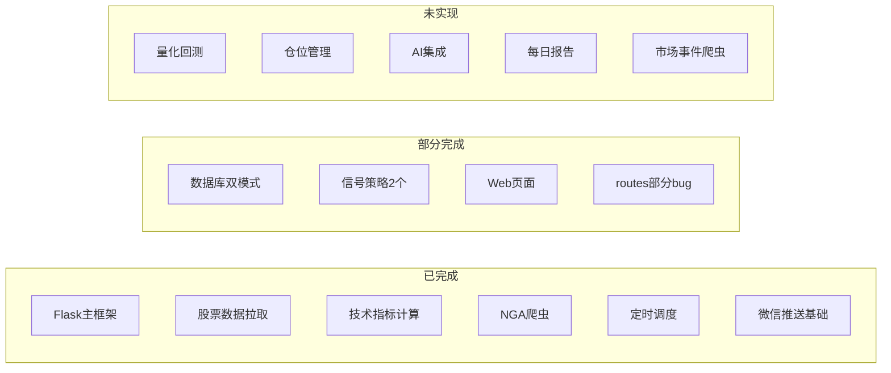
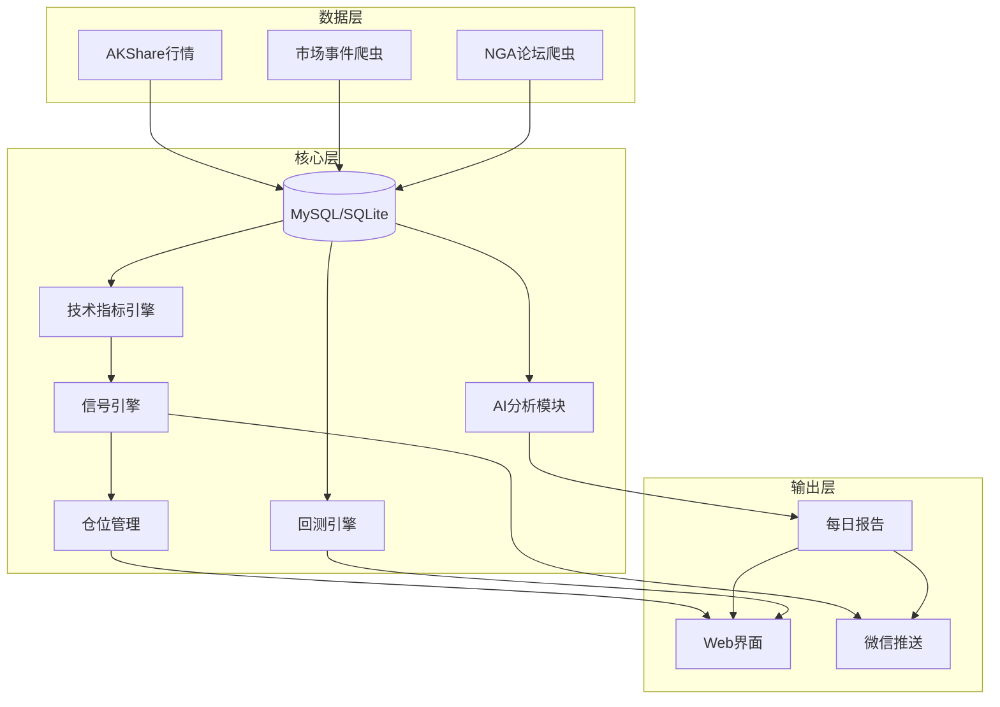

# 个人交易系统分阶段实施计划

## 现状总览

已完成的核心模块：Flask 主框架、akshare 数据拉取、TA-Lib 技术指标（MACD/KDJ/RSI/BOLL/ATR/CCI/DMI）、NGA 爬虫、APScheduler 调度、wxauto 微信推送。

部分完成的模块：数据库双模式（业务层建表仍偏 MySQL）、信号策略（仅 BOLL3 和 DLJG2）、Web 页面（quant/market_open_score 为占位）。

完全未实现：量化回测、仓位管理、AI 集成、盘前盘后报告、市场事件爬虫。

---

## 任务清单

- [x] **阶段一（基础修复与稳定化）**
  - [ x ] 阶段 1.0：确认运行环境与数据库现状
  - [ x ] 阶段 1.1：修复 routes.py 中 /api/stock_data、/api/register、check_signal_conditions 等关键接口
  - [ x ] 阶段 1.2：修复 stock_filter.py 的 target_date 硬编码与参数签名问题
  - [x] 阶段 1.3：修复 stock_list_manager.py 的 save_to_database 调用并跑通小规模更新流程
  - [x] 阶段 1.4：修复 Managers/ScanManager.py 的 self.tasks 初始化和任务管理逻辑
  - [x] 阶段 1.5：整体回归测试并更新错误日志基线
- [x] 阶段二a：统一 MySQL/SQLite 建表逻辑，实现无缝切换
- [ ] 阶段二b：实现仓位管理系统（持仓表、交易流水、资金管理、前端页面）
  - [x] 阶段 2b.1 创建基础持仓管理：在数据库中新增 `positions`/`transactions`/`portfolio` 三张表，并提供只读持仓列表页面（含股票代码、名称、数量、成本价、当前价、总市值）
  - [x] 阶段 2b.2 增加“添加操作”按钮，可以填写股票代码、买入/卖出、价格、数量，自动更新持仓与历史操作记录（含历史池子与单票操作明细页面）
  - []  阶段 2b.3 为每笔交易添加一个 ID， 在录入持仓操作的页面，当我输入股票代码后，如果该股票持仓不为 0 ，就在上面列出之前的操作，当前操作可以填写关联的操作操作 ID， 然后自动计算出两次操作之间的差价并显示在一个地方。（用于计算做 T）
- [ ] 阶段三：扩展信号策略（均线金死叉、RSI超买超卖、量价背离、MACD零轴金叉、KDJ超买超卖）
- [ ] 阶段四a：实现市场事件爬虫（东财/新浪/同花顺资讯抓取）
- [ ] 阶段四b：实现每日盘前盘后报告生成与推送
- [ ] 阶段五a：实现量化回测系统（backtrader/vectorbt + quant.html 前端）
- [ ] 阶段五b：接入 AI（LLM API），实现报告摘要、仓位分析建议、信号解读
- [ ] 阶段六：自选股票列表
    [x] 阶段六 1 创建一个新的页面，自选列表，页面样式和持仓列表一样，采用 excel 的格式
    [x] 阶段六 2 自选列表列包括 股票名/股票代码 当天价格/涨跌幅
    [x] 阶段六 3 所有在持仓列表的股票默认加入到这个自选列表中，持仓里面没有后也不需要删除
    [x] 阶段六 4 添加一个输入栏，添加自选的按键，用加号图标， 输入股票代码点击按钮，可以加入到自选列表
    [x] 阶段六 5 自选页面每 3 秒用stock_quote_tencent.py里面的接口，每天在交易日刷新股票价格，涨跌幅，如果不在交易时间内，则打开页面的时候刷新一次
    []  阶段 6 为每个股票创建一个信号通知系统，信号通知系统详见 信号通知系统.md

---

## 建议实施顺序（5个阶段）

### 阶段一：基础修复与稳定化（优先级最高）

目标：让现有系统可靠运行，消除已知 bug。以下为阶段一的细化子阶段，可独立完成和验收。

#### 阶段 1.0：环境与现状确认

- **确认运行环境**：
  - 在本机跑通 `python main.py`，确认当前是否能正常启动 Flask（不要求所有功能可用）。
  - 记录当前控制台报错/警告，作为后续对比基线。
- **确认数据库配置**：
  - 查看 `[DATABASE]` 配置，确定当前使用 MySQL 还是 SQLite。
  - 用简单脚本或现有工具确认数据库能正常连接。

#### 阶段 1.1：修复 routes.py 关键接口

- **目标**：保证核心 HTTP 接口至少能正常返回响应，不出现明显异常。
- **子任务**：
  - `/api/stock_data/<stock_code>`：去掉裸 `return`，梳理并补全返回逻辑，统一返回 JSON。
  - `/api/register`：设计/实现 `users` 表（如尚未存在）；替换或补全 `db.create_user()` 的实际实现；返回合理的状态码和错误信息。
  - `check_signal_conditions`：恢复或重写主体逻辑，至少保证入参校验、调用信号检查或占位实现，不再只返回固定字符串。
- **验收**：使用浏览器/`curl`/Postman 手工调用上述接口，确认返回结构和错误处理合理。

#### 阶段 1.2：修复 stock_filter.py 的时间与参数问题

- **目标**：让股票筛选逻辑可以在“今天”或指定日期上稳定运行。
- **子任务**：
  - 将硬编码的 `target_date = "2025-04-29"` 改为默认使用当前交易日（或当天日期），并支持通过请求参数/函数参数传入自定义日期。
  - 检查 `filter_stocks_by_filter` 参数签名与外部调用是否匹配，修正不一致的地方。
  - 为关键分支增加必要的异常处理和日志输出，便于排查筛选问题。
- **验收**：在命令行或通过 Web 页面触发一次完整的股票筛选流程，观察日志与结果是否合理。

#### 阶段 1.3：修复 stock_list_manager.py 的数据更新流程

- **目标**：保证“全市场列表 + 单股历史数据更新”流程不因明显 bug 中断。
- **子任务**：
  - 修正 `save_to_database` 对 `get_all_a_stocks()` 的错误调用方式（去掉多余参数等）。
  - 快速检查：表是否按预期创建（至少在当前使用的 DB 类型下正常）；更新流程（新增/增量更新）在小规模股票列表上能跑通。
  - 为易出错的外部调用（akshare 请求、数据库写入）补充异常捕获和日志。
- **验收**：在配置中选取少量股票，执行一次列表更新与历史数据更新，确认数据库中确有数据写入且无未捕获异常。

#### 阶段 1.4：修复 Managers/ScanManager.py 的任务管理

- **目标**：保证定时扫描任务管理模块不会因简单属性错误导致崩溃。
- **子任务**：
  - 在 `__init__` 中显式初始化 `self.tasks`（如使用 dict），并统一增删改查逻辑。
  - 检查所有对 `ScanManager` 的使用点，确保调用方式与类内部接口一致。
  - 对任务新增/删除/启停操作加上日志，方便后续调试。
- **验收**：写一个最小示例或使用现有入口，对 `ScanManager` 执行：添加一个简单任务 → 启动 → 停止 → 删除，过程中不报错。

#### 阶段 1.5：整体回归与日志基线更新

- **目标**：验证阶段 1.x 的所有改动在一起运行是否稳定。
- **子任务**：
  - 再次运行 `python main.py`，访问主页 `/`、股票相关页面/接口（如 `/stock_filter`、部分 API）、与 `ScanManager` 相关的功能（如有对应页面或 API）。
  - 对比与阶段 1.0 的日志：新增错误必须被修复；如仍有未处理的旧错误，整理成“阶段二以后的待办”。
- **验收**：系统在“正常使用一段时间”（如 10〜30 分钟简单操作）内无明显崩溃性错误，主要页面和接口可用。

#### 阶段 1.5 验收结果与错误日志基线（2026-03 更新）

- **回归脚本**：`python scripts/regression_1_5.py`（需先启动 `python main.py`）。检查项：`GET /`、`/stock_filter`、`/api/get-timed-scan-list`、`/api/stock_data/000001`、`/api/stocks`、`/quant`、`/market_open_score`。当前结果：**7/7 通过**。
- **已修复（1.5 期间）**：`tasks/check_lof.py` 中 `print(..., exc_info=True)` 改为 `logger.exception(...)`；`load_configs()` 失败或配置文件不存在时统一返回 `[]`，避免任务测试阶段报错。
- **当前启动日志基线**：Flask 正常启动；MySQL 连接池创建成功；TaskManager/APScheduler 加载任务并启动；NGA 监控可根据配置跳过。无崩溃性错误。

#### 阶段二 a 实施说明（2026-03 已完成）

- **Database**：新增 `table_exists(table_name)`，SQLite 使用 `sqlite_master`，MySQL 使用 `information_schema.tables`，供业务层统一检查表是否存在。
- **stock_list_manager.py**：`_ensure_table_exists`、`_create_stock_table` 按 `db.is_sqlite` 分支建表（SQLite 用 `INTEGER PRIMARY KEY AUTOINCREMENT`、`TEXT`、单独 `CREATE INDEX`；MySQL 保持 `ENGINE=InnoDB`）。`update_stock_history` 中表存在检查改为调用 `db.table_exists(table_name)`，不再直接查 `information_schema`。
- **stock_fetcher.py**：`_ensure_table_exists` 按 `db.is_sqlite` 分支建表，SQLite 与 MySQL 均可无缝创建 `stocks` 表。
- **Managers/ScanManager.py**：`_check_table` 按 `db.is_sqlite` 分支创建 `stock_tools_scan` 表。
- **nga_spider/nga_db.py**：已有 `_init_tables_sqlite` / `_init_tables_mysql`，无需改动。
- **验收**：切换 `config.ini` 中 `DB_TYPE=sqlite` 后启动应用，执行列表更新、定时扫描、NGA 表初始化等，表应能正确创建且无 MySQL 专用语法报错。

#### 阶段二以后待办（已知非阻塞项）

- **routes 导入**：`nga_format` 等基于 TestScripts 的导入在部分环境存在解析告警（basedpyright），不影响运行，阶段二或后续可统一路径或类型标注。

### 阶段二：数据库兼容性与信号系统完善

**目标**：实现 MySQL/SQLite 无缝切换，扩展信号策略。

- **统一建表逻辑**：在 stock_list_manager.py、stock_fetcher.py、nga_spider/nga_db.py、Managers/ScanManager.py 中，使用 `Database.adapt_sql()` 或按 `db_type` 分支建表，去掉 MySQL 专用语法（`ENGINE=InnoDB`、`AUTO_INCREMENT` 等）
- **修复 `information_schema` 引用**：SQLite 下改用 `sqlite_master` 检查表是否存在
- **扩展信号策略**：在 `signals/` 目录新增 3-5 个常用策略：
  - 均线金叉/死叉信号
  - RSI 超买超卖信号
  - 量价背离信号
  - MACD 零轴上方金叉
  - KDJ 超买超卖区域

### 阶段三：仓位管理系统

**目标**：实现持仓跟踪、资金管理、盈亏计算。

- **新增数据库表**：
  - `positions`（持仓表）：stock_code, buy_price, quantity, buy_date, status
  - `transactions`（交易流水）：stock_code, action(buy/sell), price, quantity, date, fee
  - `portfolio`（组合概览）：total_capital, available_cash, market_value
- **新增 `position_manager.py` 模块**：
  - 开仓/平仓/加仓/减仓操作
  - 持仓盈亏实时计算（结合当前行情数据）
  - 仓位比例控制（单只股票不超过总资金 X%）
  - 止损止盈逻辑
- **新增前端页面**：持仓管理页面，展示当前持仓、盈亏、资金曲线
- **与信号系统联动**：信号触发时，自动建议开仓/平仓操作

### 阶段四：市场事件爬虫与每日报告

**目标**：自动采集市场资讯，生成盘前盘后报告。

- **市场事件爬虫**（新建 `crawls/market_news_crawler.py`）：
  - 数据源：东方财富快讯、新浪财经、同花顺资讯等
  - 定时抓取（通过 APScheduler），存入 `market_news` 表
  - 关键词过滤与分类（政策、行业、个股、宏观）
- **每日报告系统**（新建 `reports/` 目录）：
  - **盘前报告**（每日 9:00）：隔夜外盘表现、A50 期指涨跌、重要新闻摘要、关注股票的技术面概要
  - **盘后报告**（每日 15:30）：大盘走势总结、涨跌停统计、关注股票信号汇总、持仓盈亏日报
  - 报告通过微信推送 + Web 页面展示
- **完善 `market_open_score.html`**：对接已有的 `Tools/DaPanScore/` 模块，展示实际评分数据

### 阶段五：量化回测与 AI 集成

**目标**：实现策略回测验证，接入 AI 辅助决策。

- **量化回测系统**（新建 `backtest/` 目录）：
  - 引入 `backtrader` 或 `vectorbt` 作为回测引擎
  - 将现有信号策略（BOLL3、DLJG2 等）封装为可回测的因子
  - 回测结果指标：年化收益、最大回撤、夏普比率、胜率
  - 前端 `quant.html` 接入：策略选择、参数调整、回测结果可视化
- **AI 集成**（新建 `ai/` 目录）：
  - 接入 LLM API（OpenAI / 通义千问 / DeepSeek 等）
  - 功能 1：每日报告 AI 摘要生成（将爬取的新闻 + 行情数据喂给 LLM，生成分析报告）
  - 功能 2：仓位分析建议（基于当前持仓 + 技术指标 + 市场环境，AI 给出调仓建议）
  - 功能 3：信号解读（当信号触发时，AI 结合上下文给出买卖建议的文字说明）

---

## 技术架构演进

---

## 建议的起步顺序

1. **先从阶段一开始**：修复现有 bug，约需 1-2 天，确保系统能稳定运行
2. **然后阶段二**：数据库兼容 + 新增 3-5 个信号策略，约需 3-5 天
3. **阶段三四可并行推进**：仓位管理和市场爬虫/报告系统相对独立
4. **阶段五放在最后**：量化回测和 AI 集成需要前面的基础设施支撑
