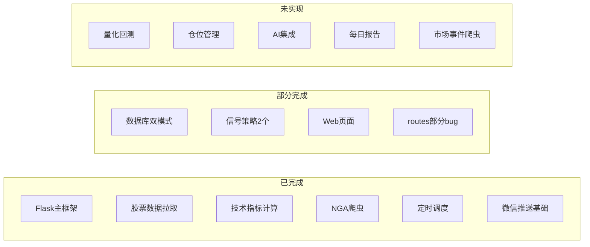
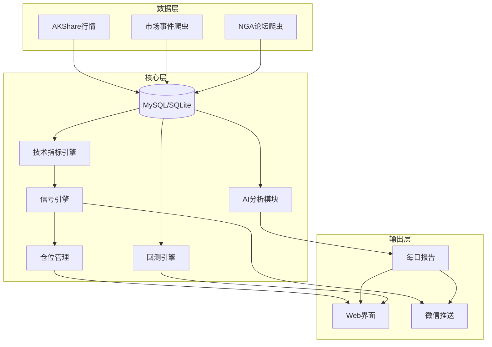

# 个人交易系统分阶段实施计划

## 现状总览

已完成的核心模块：Flask 主框架、akshare 数据拉取、TA-Lib 技术指标（MACD/KDJ/RSI/BOLL/ATR/CCI/DMI）、NGA 爬虫、APScheduler 调度、wxauto 微信推送。

部分完成的模块：数据库双模式（业务层建表仍偏 MySQL）、信号策略（仅 BOLL3 和 DLJG2）、Web 页面（quant/market_open_score 为占位）。

完全未实现：量化回测、仓位管理、AI 集成、盘前盘后报告、市场事件爬虫。

---

## 任务清单

- [ ] 阶段一：修复 routes.py、stock_filter.py、stock_list_manager.py、ScanManager.py 中的已知 bug
- [ ] 阶段二a：统一 MySQL/SQLite 建表逻辑，实现无缝切换
- [ ] 阶段二b：扩展信号策略（均线金死叉、RSI超买超卖、量价背离、MACD零轴金叉、KDJ超买超卖）
- [ ] 阶段三：实现仓位管理系统（持仓表、交易流水、资金管理、前端页面）
- [ ] 阶段四a：实现市场事件爬虫（东财/新浪/同花顺资讯抓取）
- [ ] 阶段四b：实现每日盘前盘后报告生成与推送
- [ ] 阶段五a：实现量化回测系统（backtrader/vectorbt + quant.html 前端）
- [ ] 阶段五b：接入 AI（LLM API），实现报告摘要、仓位分析建议、信号解读

---

## 建议实施顺序（5个阶段）

### 阶段一：基础修复与稳定化（优先级最高）

**目标**：让现有系统可靠运行，消除已知 bug。

- **修复 routes.py 中的 bug**：
  - `/api/stock_data/<stock_code>` 路由有裸 `return`，后续逻辑被短路（约第 161-214 行）
  - `/api/register` 调用了未定义的 `db.create_user()`（约第 501-512 行）
  - `check_signal_conditions` 主体逻辑被注释，返回固定字符串（约第 966-1002 行）
- **修复 stock_filter.py** 中硬编码的 `target_date = "2025-04-29"`，改为动态获取
- **修复 stock_list_manager.py** 中 `save_to_database` 调用参数错误（第 124 行）
- **修复 Managers/ScanManager.py** 中 `self.tasks` 未初始化的 AttributeError

### 阶段二：数据库兼容性与信号系统完善

**目标**：实现 MySQL/SQLite 无缝切换，扩展信号策略。

- **统一建表逻辑**：在 stock_list_manager.py、stock_fetcher.py、nga_spider/nga_db.py、Managers/ScanManager.py 中，使用 `Database.adapt_sql()` 或按 `db_type` 分支建表，去掉 MySQL 专用语法（`ENGINE=InnoDB`、`AUTO_INCREMENT` 等）
- **修复 `information_schema` 引用**：SQLite 下改用 `sqlite_master` 检查表是否存在
- **扩展信号策略**：在 `signals/` 目录新增 3-5 个常用策略：
  - 均线金叉/死叉信号
  - RSI 超买超卖信号
  - 量价背离信号
  - MACD 零轴上方金叉
  - KDJ 超买超卖区域

### 阶段三：仓位管理系统

**目标**：实现持仓跟踪、资金管理、盈亏计算。

- **新增数据库表**：
  - `positions`（持仓表）：stock_code, buy_price, quantity, buy_date, status
  - `transactions`（交易流水）：stock_code, action(buy/sell), price, quantity, date, fee
  - `portfolio`（组合概览）：total_capital, available_cash, market_value
- **新增 `position_manager.py` 模块**：
  - 开仓/平仓/加仓/减仓操作
  - 持仓盈亏实时计算（结合当前行情数据）
  - 仓位比例控制（单只股票不超过总资金 X%）
  - 止损止盈逻辑
- **新增前端页面**：持仓管理页面，展示当前持仓、盈亏、资金曲线
- **与信号系统联动**：信号触发时，自动建议开仓/平仓操作

### 阶段四：市场事件爬虫与每日报告

**目标**：自动采集市场资讯，生成盘前盘后报告。

- **市场事件爬虫**（新建 `crawls/market_news_crawler.py`）：
  - 数据源：东方财富快讯、新浪财经、同花顺资讯等
  - 定时抓取（通过 APScheduler），存入 `market_news` 表
  - 关键词过滤与分类（政策、行业、个股、宏观）
- **每日报告系统**（新建 `reports/` 目录）：
  - **盘前报告**（每日 9:00）：隔夜外盘表现、A50 期指涨跌、重要新闻摘要、关注股票的技术面概要
  - **盘后报告**（每日 15:30）：大盘走势总结、涨跌停统计、关注股票信号汇总、持仓盈亏日报
  - 报告通过微信推送 + Web 页面展示
- **完善 `market_open_score.html`**：对接已有的 `Tools/DaPanScore/` 模块，展示实际评分数据

### 阶段五：量化回测与 AI 集成

**目标**：实现策略回测验证，接入 AI 辅助决策。

- **量化回测系统**（新建 `backtest/` 目录）：
  - 引入 `backtrader` 或 `vectorbt` 作为回测引擎
  - 将现有信号策略（BOLL3、DLJG2 等）封装为可回测的因子
  - 回测结果指标：年化收益、最大回撤、夏普比率、胜率
  - 前端 `quant.html` 接入：策略选择、参数调整、回测结果可视化
- **AI 集成**（新建 `ai/` 目录）：
  - 接入 LLM API（OpenAI / 通义千问 / DeepSeek 等）
  - 功能 1：每日报告 AI 摘要生成（将爬取的新闻 + 行情数据喂给 LLM，生成分析报告）
  - 功能 2：仓位分析建议（基于当前持仓 + 技术指标 + 市场环境，AI 给出调仓建议）
  - 功能 3：信号解读（当信号触发时，AI 结合上下文给出买卖建议的文字说明）

---

## 技术架构演进

---

## 建议的起步顺序

1. **先从阶段一开始**：修复现有 bug，约需 1-2 天，确保系统能稳定运行
2. **然后阶段二**：数据库兼容 + 新增 3-5 个信号策略，约需 3-5 天
3. **阶段三四可并行推进**：仓位管理和市场爬虫/报告系统相对独立
4. **阶段五放在最后**：量化回测和 AI 集成需要前面的基础设施支撑
